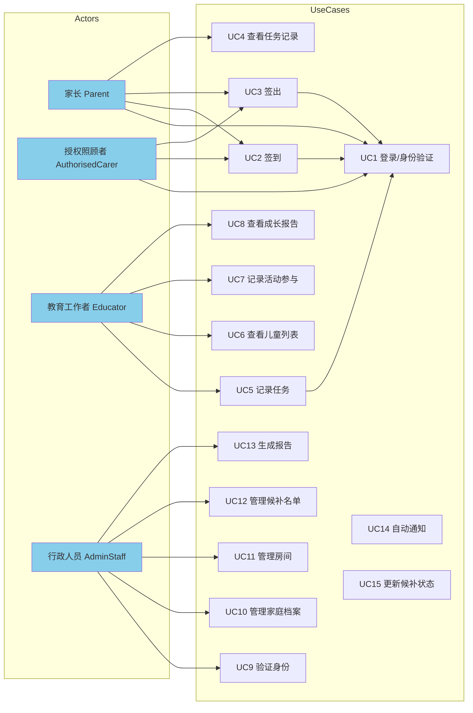
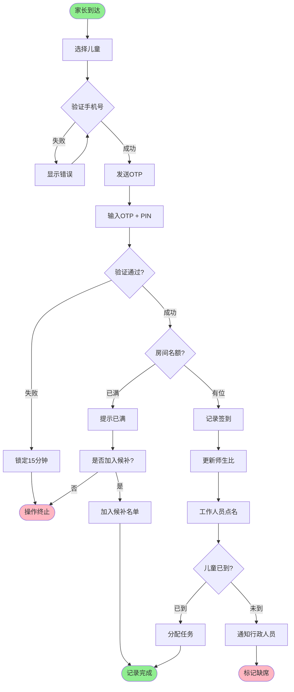
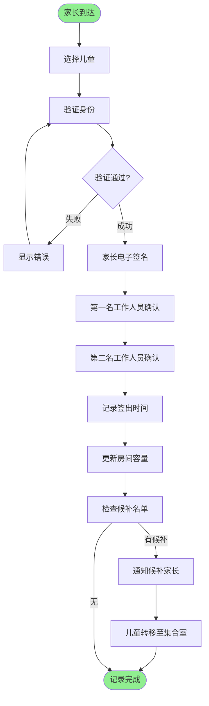
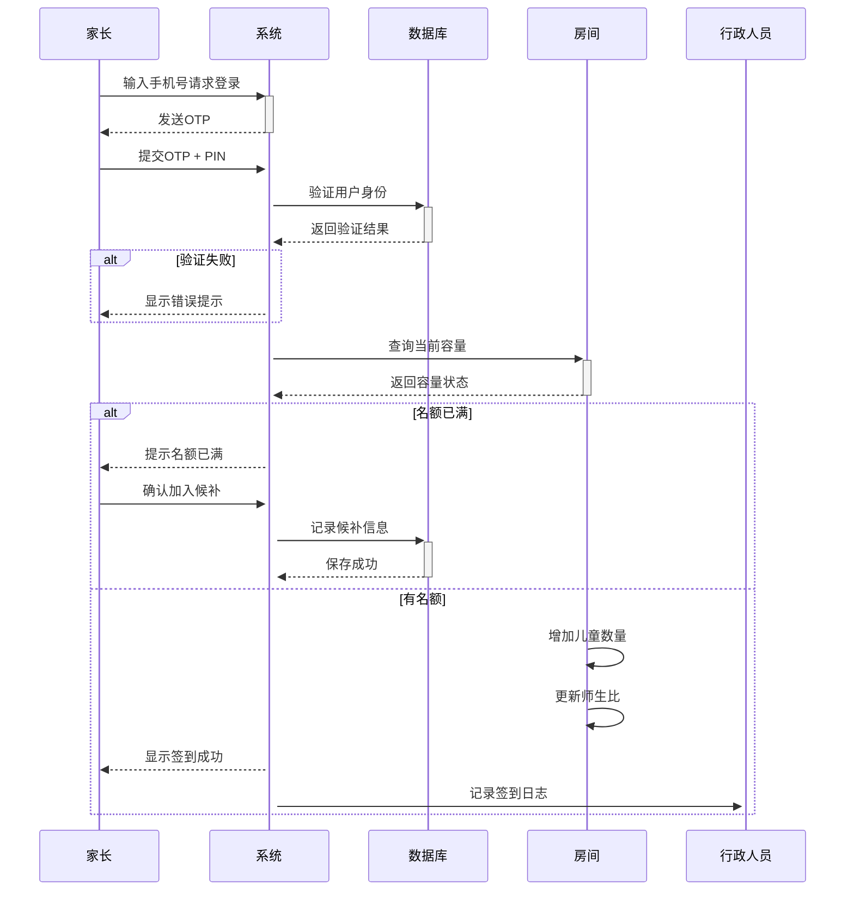
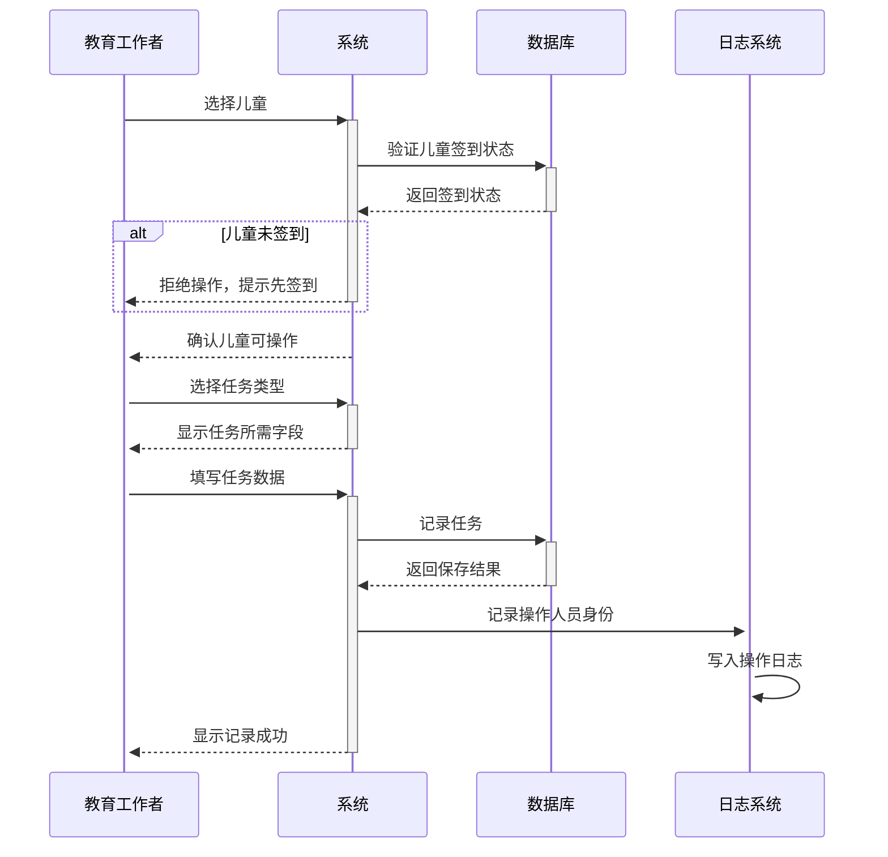
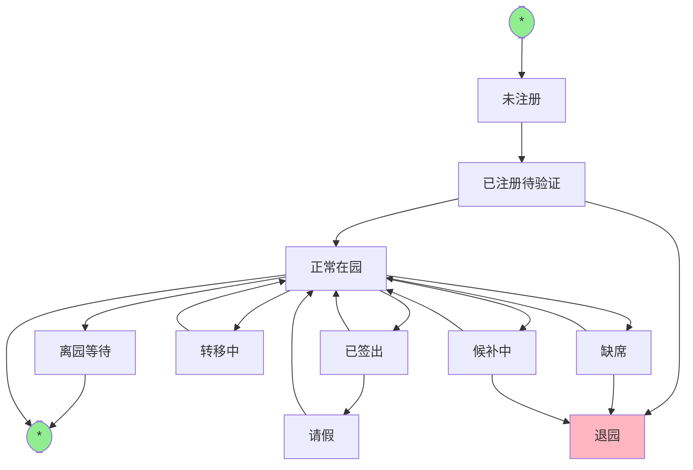
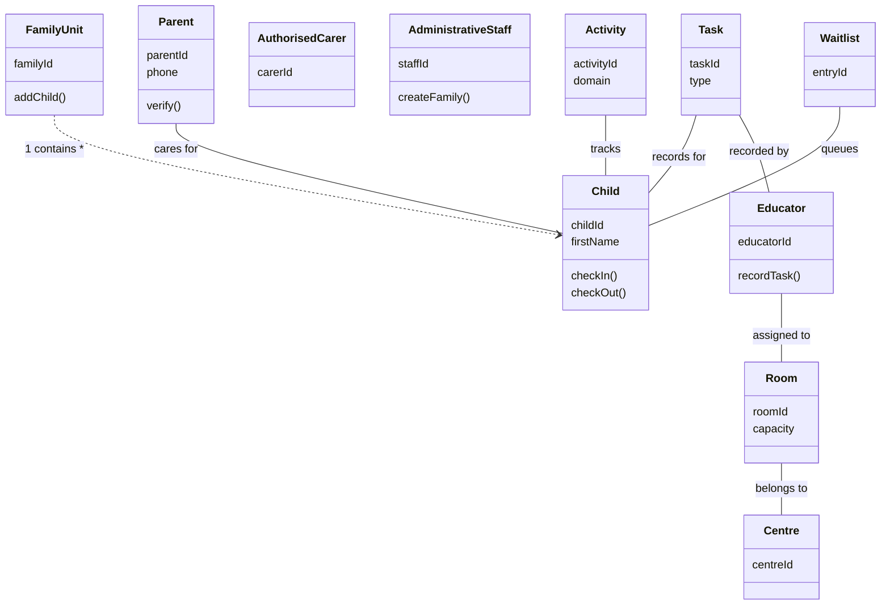

# UQKids 幼儿园管理系统 — 系统分析与设计

> 课程：BISM7255 | 客户：UQKids | 截止：2026-04-17

---

## 一、执行摘要

UQKids 是一家遵循蒙台梭利教育理念的幼儿教育机构（6 个月至 6 岁），为满足政府拨款开发要求，需要设计一套儿童托管管理系统（CRM + 预订系统）。系统核心功能包括：客户档案管理（含儿童、家长、教育工作者、行政人员）、中心房间与容量管理、日常任务记录（餐食/睡眠/如厕等）以及儿童成长活动追踪。报告采用 UML 建模，使用 Enterprise Architect 制作五类图表，为后续开发提供完整的需求规格和系统设计蓝图。

---

## 二、功能性需求（F1–F5）

### F1 — 儿童签到与签出

> 作为一名**家长或授权照顾者**，我希望能够对自己的孩子进行电子签到和签出，这样我就能记录孩子每日的出勤情况，并确保孩子的安全。

**验收标准（AC）：**

1. 家长或授权照顾者必须先通过手机号 + OTP 验证身份，才能进行签到/签出操作。
2. 签到时系统记录：儿童姓名、签到时间、负责签到的人员身份（家长/授权照顾者/工作人员）。
3. 儿童在签到前，系统不允许为其分配任何任务（如餐食、喂水等）。
4. 签出时必须由家长或授权照顾者进行电子签名，且需两名工作人员确认儿童已离园。
5. 若儿童缺席，系统自动将空出名额提供给候补名单上的儿童。
6. 所有签到/签出记录均附带时间戳，格式符合澳大利亚国家质量标准（NQS）要求。

---

### F2 — 房间容量与师生比管理

> 作为一名**教育工作者**，我希望系统自动监控每个房间的儿童数量和师生比例，这样我就能确保运营始终符合昆士兰州的法律要求。

**验收标准（AC）：**

1. 系统实时显示每个房间的当前儿童数量、最大容量和当前师生比。
2. 当某房间儿童数量达到上限时，系统阻止新的签到操作，并提示"名额已满，可加入候补名单"。
3. 当师生比低于法定要求（婴儿室 1:5， toddler 1:4 等）时，系统发出警告并通知行政人员。
4. 候补名单按申请时间排序（FIFO），空出名额时系统自动通知候补名单上的家长。
5. 房间可临时调整（儿童可在特定条件下跨房间转移），但系统记录所有转移操作。
6. 机动人员（3 名）可在任意房间顶班，系统支持临时人员调配。

---

### F3 — 儿童日常任务记录

> 作为一名**教育工作者**，我希望能够随时记录每个儿童的日常任务（餐食、睡眠、尿布检查等），这样我就能确保所有照护活动都被完整记录，方便家长了解孩子的一天。

**验收标准（AC）：**

1. 任务记录包含：任务类型、计划时间、实际完成时间、记录的工作人员、涉及的儿童。
2. 系统强制验证：任务开始前儿童必须已签到，未签到儿童无法分配任务。
3. 同一儿童的任务不能有时间重叠（如正在睡觉不能同时喂食）。
4. 系统支持随时记录，无需在固定时间点操作（上午茶时间并非固定，系统接受灵活记录）。
5. 每日结束时，任务按时间顺序排列生成"儿童日报"，家长可查看。
6. 任务记录包含必要的特定字段（如：餐食记录"吃了多少"、尿布检查记录"腹泻/尿液/肠"）。

---

### F4 — 家长与授权照顾者身份验证

> 作为一名**行政人员**，我希望系统对新家长和授权照顾者进行严格的身份验证，这样我就能确保只有经过核实的人员才能访问系统，保护儿童数据安全。

**验收标准（AC）：**

1. 新家长/授权照顾者必须由行政人员（持证工作人员）当面核实其驾照等 100 分身份证件，系统仅记录"证件类型、核实工作人员、核实时间"，不记录证件照片或号码。
2. 验证通过后，家长使用手机号登录，系统发送 OTP（一次性密码）进行身份验证。
3. 首次登录后，家长必须设置 4 位数个人识别码（PIN），用于后续快速身份验证。
4. 家长和授权照顾者每年需要重新完成 OTP 和 PIN 的设置（年度重新验证）。
5. 授权照顾者只能查看/操作与其关联的儿童，无权访问其他儿童信息。
6. 若系统发生数据泄露，泄露的信息不包含任何可识别的 PII（仅包含系统已记录的结构化数据）。

---

### F5 — 儿童成长活动追踪

> 作为一名**教育工作者**，我希望能够记录每个儿童参与蒙台梭利活动的情况，并追踪其在各领域的发展进度，这样我就能为家长提供有意义的成长报告。

**验收标准（AC）：**

1. 系统支持记录儿童在蒙台梭利五大领域的活动参与情况：实用生活、感官、数学、语言、文化。
2. 每次活动参与记录包含：活动名称、参与日期、参与评价（初次接触/互动参与/逐步进步/熟练掌握/退步）。
3. 同一活动可多次参与，系统保留所有历史记录并标注时间线。
4. 系统生成儿童成长轨迹报告，按领域分类，家长可查看历史数据。
5. 教育工作者可为每个儿童设定个体发展目标，系统在达成时通知记录者。
6. 活动评价为"退步"时，系统要求工作者提供简短说明（可选字段）。

---

## 三、非功能性需求（NF1–NF5）

### NF1 — 易用性

> 作为一名**系统管理员**，我希望系统对数字技术不熟练的用户（如部分家长）足够简单易用，这样所有家长都能顺畅操作系统，无需技术培训。

**验收标准（AC）：**

1. 系统登录步骤不超过 3 步（手机号 → OTP → PIN），普通用户可在 2 分钟内完成首次登录。
2. 主要操作（签到、签出、查看任务）均有图形化按钮，文字标签清晰，无专业术语。
3. 系统在所有操作完成后提供明确的成功/失败反馈（屏幕提示）。
4. 支持移动端响应式布局，方便家长使用手机操作。
5. 家长界面语言为直观的简体中文，无技术缩写或行业黑话。
6. 帮助文档入口在每页可见，常见问题（FAQ）覆盖签到失败、OTP 未收到等高频问题。

---

### NF2 — 性能

> 作为一名**系统管理员**，我希望系统在高峰时段（如早晨签到 7:00–9:00）依然响应迅速，这样家长不会因系统卡顿而产生不满。

**验收标准（AC）：**

1. 系统 90% 的页面请求在 2 秒内完成加载。
2. 早晨高峰期（7:00–9:00，最多并发 50 名家长）签到操作响应时间不超过 3 秒。
3. 数据库查询（签到记录、儿童信息查询）在 500ms 内返回结果。
4. 系统支持至少 50 名用户同时在线操作而不出现性能下降。
5. 签到/签出操作失败时，系统在 1 秒内向用户显示错误提示，不出现空白页面。
6. 系统每日自动生成报告时，不影响前台实时操作的响应速度。

---

### NF3 — 安全

> 作为一名**系统管理员**，我希望系统具备严格的安全机制，保护儿童和家长的隐私数据，这样我就能符合澳大利亚儿童数据保护法规。

**验收标准（AC）：**

1. 所有网络通信使用 HTTPS 加密传输，密码和 PIN 以不可逆哈希算法存储。
2. 用户连续 5 次输入错误 OTP，账户锁定 15 分钟，需联系行政人员解锁。
3. 行政人员对所有用户数据的访问均有操作日志，日志保留不少于 7 年。
4. 系统定期（每月）自动备份数据库，备份文件加密存储于独立于主服务器的存储介质。
5. 授权照顾者访问权限仅限于其关联儿童的信息，无法查询其他家庭数据。
6. 身份证件验证记录（证件类型、工作人员、日期时间）与证件本身（照片/号码）物理隔离存储。

---

### NF4 — 可用性 / 可靠性

> 作为一名**系统管理员**，我希望系统在发生硬件或软件故障时能够快速恢复，这样我就能确保中心运营不因系统问题而中断。

**验收标准（AC）：**

1. 系统每日可用时间达到 99.5%（不含计划维护窗口），每月宕机时间不超过 3.6 小时。
2. 系统发生非计划性故障时，自动向管理员发送警报，响应时间不超过 5 分钟。
3. 故障恢复后，系统自动恢复签到/签出数据的完整性，不丢失任何已记录的任务数据。
4. 数据库采用 WAL（预写日志）机制，任何操作中断不会导致数据损坏。
5. 若系统完全不可用（极端情况），中心保留纸质备用表格用于临时记录，后续可手动录入系统。
6. 系统提供操作超时提示（如网络中断时），防止用户误以为操作已成功而实际未提交。

---

### NF5 — 可扩展性与可维护性

> 作为一名**系统管理员**，我希望系统在业务增长（如开设新中心或新增服务类型）时能够方便扩展，这样我就能降低未来升级的成本。

**验收标准（AC）：**

1. 系统架构采用模块化设计，新增房间类型或服务项目无需修改核心代码。
2. 支持多中心部署，各中心数据隔离，同一管理平台可跨中心管理。
3. 数据库设计遵循第三范式（3NF），新增字段或表不对现有结构产生负面影响。
4. 系统的日志记录结构化且标准化，支持 ELK/Graylog 等主流日志分析平台接入。
5. 核心业务逻辑（签到规则、师生比计算）封装为独立服务模块，便于单独测试和更新。
6. 系统文档（需求规格、设计文档、API 文档）随代码版本管理，支持回溯到任意历史版本。

---

## 四、UML 模型设计

> 所有图表使用 Enterprise Architect（EA）制作，导出为图像嵌入报告，原始 .eapx 文件随报告一并提交。

### 4.1 设计方法概述

采用**面向对象分析与设计（OOAD）**方法，从业务需求出发，首先识别系统中的核心业务实体（儿童、家长、家庭单位、房间、任务、活动），再基于这些实体构建 UML 模型。设计遵循以下原则：

- **封装性**：每个类承担单一职责，属性和操作紧耦合
- **可扩展性**：使用接口和继承关系预留扩展点
- **业务对齐**：所有模型元素直接映射业务概念，不引入纯技术性类
### 4.2 用例图（Use Case Diagram）

**目的：** 展示系统的主要参与者（Actor）以及他们与系统的交互行为，是需求建模的起点。

**关键设计决策：**

- **Actor 概括**：将"家长"和"授权照顾者"概括为"家庭成员（Family Member）"，共享签到/签出的基本行为，同时保留授权照顾者的受限权限
- **包含关系（includes）**：签到用例包含"OTP 验证"子流程，确保验证逻辑复用
- **扩展关系（extends）**：签到用例在"名额已满"条件下扩展为"加入候补名单"
- **核心参与者**：家长、授权照顾者、教育工作者、行政人员、管理系统
- **主要用例**：登录/验证、签到、签出、查看任务、记录任务、查看成长报告、管理房间、管理候补名单、身份验证管理

**假设：**
- 家长可为多名儿童操作（同一家庭的多子女）
- 授权照顾者不具有查看任务记录的权限，仅可签到/签出

### 4.3 活动图（Activity Diagram）×2

**目的：** 描述签到和签出流程中的活动流转、决策点和并行处理。

#### 活动图 A — 签到流程

**关键流程：**

1. 家长/授权照顾者到达中心
2. 选择儿童（若有多名儿童，显示选择列表）
3. 系统验证身份（手机号 + OTP）
4. 系统确认 PIN
5. 触发儿童签到：记录儿童姓名、时间、操作人
6. 工作人员点名确认（上午 9:00 例行）
7. 若儿童未到，系统通知行政人员联系家长
8. 若名额空出，系统检查候补名单并通知下一位

**泳道：** 家长/授权照顾者 | 系统 | 教育工作者 | 行政人员

**决策点：**
- OTP 验证是否通过？
- 房间名额是否已满？
- 儿童是否已到园？

**假设：**
- 家长可为多名儿童批量签到（一次操作完成）
- 上午 9:00 点名为独立活动，但触发签到确认逻辑

#### 活动图 B — 签出流程

**关键流程：**

1. 家长/授权照顾者到达中心
2. 选择儿童
3. 系统验证身份
4. 家长进行电子签名（签出确认）
5. 两名工作人员分别确认
6. 系统记录签出时间
7. 儿童转移至集合室（探索者班/开拓者班）
8. 系统更新当日记录

**泳道：** 家长/授权照顾者 | 系统 | 教育工作者

### 4.4 序列图（Sequence Diagram）×2

**目的：** 展示签到和任务记录两个关键工作流中，对象之间消息传递的时序关系。

#### 序列图 A — 儿童签到时序

```
家长 → 系统: 输入手机号请求登录
系统 → 家长: 发送 OTP
家长 → 系统: 提交 OTP + PIN
系统 → 数据库: 验证用户身份
数据库 → 系统: 返回验证结果
系统 → 房间: 查询当前容量
房间 → 系统: 返回容量状态
房间 → 系统: 增加儿童数量
房间 → 系统: 更新师生比
系统 → 家长: 显示签到成功
系统 → 行政人员: 记录签到日志
```

**关键设计决策：**
- 房间对象作为容量管理的主体，签到操作直接修改房间状态
- 师生比检查在签到成功后立即触发，确保合规

#### 序列图图 B — 任务记录时序

```
教育工作者 → 系统: 选择儿童（扫描手环/选择界面）
系统 → 数据库: 验证儿童是否已签到
数据库 → 系统: 返回签到状态
系统 → 教育工作者: 确认儿童可操作
教育工作者 → 系统: 选择任务类型（餐食/睡眠/如厕等）
系统 → 教育工作者: 显示任务所需字段
教育工作者 → 系统: 填写任务数据（时间、内容）
系统 → 数据库: 记录任务（含实际时间戳）
系统 → 日志: 记录操作人员身份
系统 → 教育工作者: 显示记录成功
```

**关键设计决策：**
- 任务记录前强制检查签到状态，防止虚假记录
- 实际操作时间由系统自动记录，而非工作者手动输入

### 4.5 状态图（State Diagram）

**目的：** 描述儿童对象在系统中可能处于的状态及其转换。

**状态（10+）：**

| 状态 | 说明 |
|------|------|
| 未注册 | 儿童尚未在系统中创建档案 |
| 已注册待验证 | 档案已创建，等待家长验证通过 |
| 正常在园 | 当天已签到并在园内 |
| 已签出 | 当天已完成签出 |
| 缺席 | 已预约但当天未签到 |
| 候补中 | 名额已满，加入等待名单 |
| 请假 | 家长提前取消当天预约 |
| 退园 | 永久离开 UQKids |
| 转移中 | 临时转移至其他房间 |
| 离园（在园但不在原房间） | 已签出等待家长接走 |

**关键转换触发器：**

- 签到成功 → 正常在园（trigger: `checkIn()`）
- 签出确认 → 已签出（trigger: `checkOut()`）
- 预约名额满 → 候补中（trigger: `joinWaitlist()`）
- 候补轮到 → 正常在园（trigger: `admitFromWaitlist()`）
- 家长取消 → 请假（trigger: `cancelBooking()`）

**假设：**
- 儿童同一天内只能处于一种状态
- "缺席"状态在上午 9:30 自动评估（家长未联系则标记为缺席）

### 4.6 类图（Class Diagram）

**目的：** 展示系统的核心数据结构、类之间的关系以及关键属性。

**类（10+）：**

| 类名 | 主要属性 | 关键方法 |
|------|---------|---------|
| `Child` | childId, firstName, lastName, DOB, gender, CRN, familyId | getActivities(), checkIn(), checkOut() |
| `FamilyUnit` | familyId, primaryGuardianId, CRN | addChild(), removeChild(), getChildren() |
| `Parent` | parentId, firstName, lastName, phone, address, isPrimaryGuardian | verify(), setPIN() |
| `AuthorisedCarer` | carerId, firstName, lastName, phone, familyId | checkInChild(), checkOutChild() |
| `Educator` | educatorId, firstName, lastName, roomId | recordTask(), getChildren() |
| `AdministrativeStaff` | staffId, firstName, lastName | createFamily(), verifyIdentity() |
| `Room` | roomId, name, ageRange, capacity, ratio, centreId | getCurrentCount(), checkCapacity(), isRatioCompliant() |
| `Centre` | centreId, name, address, openTime, closeTime | getRooms(), getStaff() |
| `Task` | taskId, childId, educatorId, type, plannedTime, actualTime, notes | validate() |
| `Activity` | activityId, childId, domain, name, engagementLevel, date | recordProgress() |
| `Waitlist` | entryId, childId, requestedDate, status, createdAt | admit() |
| `AttendanceRecord` | recordId, childId, checkInTime, checkOutTime, checkedInBy | isValid() |

**关系：**

- **组合关系**：`FamilyUnit` 组合 `Child`（1 个家庭包含多名儿童）
- **聚合关系**：`Centre` 聚合 `Room`（中心包含多个房间）
- **关联关系**：`Educator` 与 `Room` 关联（教育工作者分配到房间）
- **泛化关系**：`Parent` 与 `AuthorisedCarer` 泛化为 `FamilyMember`（共享部分行为）
- **多重性**：1 个 `Room` : 0..* 名 `Child`；1 个 `FamilyUnit` : 1..2 名 `Parent` + 0..* 名 `AuthorisedCarer`

---

## 五、关键设计决策说明

### 5.1 为什么需要 FamilyUnit 这个实体？

儿童与家长的关系通过"家庭单位"中介实体管理，原因：
1. 一个家庭可能有两名家长（父亲+母亲）+ 授权照顾者
2. 儿童需要同时与多名成人关联
3. 方便管理主要监护人身份（家庭只能有一个主要监护人）

### 5.2 签到为什么需要两名工作人员确认？

澳大利亚 NQS（国家质量标准）要求所有儿童出入有记录，且幼儿安全需要双重确认，防止儿童被错误带走。

### 5.3 为什么不存储身份证件照片/号码？

防止数据泄露后 PII 大规模泄露。仅记录"看到了什么类型的证件"而非证件本身，即便数据库被拖走也无法直接用于身份欺诈。

### 5.4 任务为什么不能时间重叠？

处于睡眠状态的孩子无法同时进食，这是幼儿照护的基本安全规则。系统在任务分配层面强制校验，防止工作者疏忽导致安全事故。

---

## 六、AI 使用声明

本次 BISM7255 Assignment 1 报告中，以下 AI 工具使用了以下方式：

- **ChatGPT/Claude（本次）**：用于辅助结构化思维框架、生成用户故事初稿、整理验收标准。所有 AI 生成内容均经过批判性审核和修改，确保符合课程要求和UQKids 实际业务场景。
- **Enterprise Architect**：UML 图制作（课程要求不得使用 AI 生成 UML 图）


---

*文档创建：2026-04-10*
*工具：pypdf 解析 + 贾维斯整理*

---


## 六、UML 模型（Mermaid 渲染预览）

> ⚠️ 以下 Mermaid 图为设计预览。课程要求使用 Enterprise Architect 制作 UML 图并导出图像嵌入报告，.eapx 文件一并提交。

### 6.1 用例图（Use Case Diagram）



### 6.2 活动图 — 签到流程（Activity Diagram）



### 6.3 活动图 — 签出流程（Activity Diagram）



### 6.4 序列图 — 签到时序（Sequence Diagram）



### 6.5 序列图 — 任务记录时序（Sequence Diagram）



### 6.6 状态图（State Diagram）



### 6.7 类图（Class Diagram）



